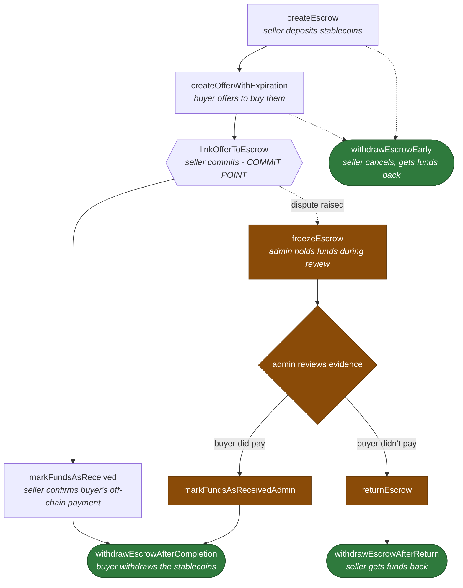

# WireMe EVM Contracts

Solidity contracts implementing WireMe's crypto-to-fiat escrow flow: a user locks stablecoins
in escrow, a broker makes an offer, and funds release to the broker on completion or back to
the user if withdrawn early or returned by an admin. This repo holds the contract source and
its Foundry test suite. It does not deploy anything itself - see [Deployment](#deployment).

## Architecture

All of WireMe's own contracts live under `src/fx-contracts/`, split into two layers:

**`fx-escrow/`** - the escrow itself, and the only layer still under active development.
- `AbstractFxEscrowMulti.sol` - core logic: creating escrows and offers, the
  freeze/defrost/return/withdraw lifecycle, broker security deposits, platform fees, and admin
  authorization lists.
- `FxEscrowMultiStorage.sol` - the storage layout, kept in its own contract so it stays stable
  across upgrades (the proxy and the implementation must agree on slot order).
- `FxEscrowMulti.sol` - the concrete implementation contract deployed behind the proxy.
- `proxy/ProxyFxEscrowMulti.sol` - the contract actually deployed and interacted with in
  production. Delegatecalls into whichever implementation address `setImplementation` points at.
- `configuration/EscrowConfig.sol` - maps a token symbol (`keccak256("USDC")`, etc.) to its
  ERC20 contract address.

**`smart-wallet/`** - **deprecated**, see [Deprecated: smart-wallet layer](#deprecated-smart-wallet-layer)
below before touching anything here.

`src/EscrowStructs.sol` holds the shared structs (`FXEscrow`, `FXEscrowOffer`, `BrokerDeposit`,
etc.) used across both layers.

### Actor model

Every state-changing escrow function is gated by one of three modifiers:

- `onlyAdmin` - a single admin address (freeze/defrost/return escrows, manage authorization
  lists, withdraw platform fees, confiscate/freeze broker deposits, swap the config contract).
- `onlyAuthorizedUsers` - addresses explicitly allow-listed via `addAuthorizedUser` (create
  escrows, mark funds received, extend/withdraw their own escrows).
- `onlyAuthorizedBrokers` - addresses allow-listed via `addAuthorizedBroker` (make offers,
  withdraw after completion, manage their security deposit).

Authorization is a plain address allow-list (`isAuthorizedUser`/`isAuthorizedBroker`) - the
escrow contract doesn't care what kind of account or contract is calling it, only whether that
address has been added. That's what makes the smart-wallet deprecation possible: any address the
backend controls can be authorized directly, with or without a wallet contract in front of it.

## Trade lifecycle

In escrow terms the two sides are "user" and "broker"; in trade terms they're seller and buyer -
the seller (user) deposits stablecoins and receives fiat off-chain, the buyer (broker) pays fiat
off-chain and receives the stablecoins. Every trade follows the same tree, and a dispute can only
branch off after the seller commits via `linkOfferToEscrow` - before that point either side can
still walk away.



- **Before the commit point** (`createEscrow` -> `createOfferWithExpiration`): an outstanding
  offer doesn't lock anything in - `withdrawEscrowEarly` works right up until `linkOfferToEscrow`
  is called, regardless of whether an offer exists yet.
- **The commit point** (`linkOfferToEscrow`): the seller picks an offer and locks the trade in.
  This is the only admin-free action that closes off cancellation - after this,
  `withdrawEscrowEarly` and `extendEscrow` both revert.
- **Sunny day**: `markFundsAsReceived` (seller confirms) -> `withdrawEscrowAfterCompletion`
  (buyer withdraws, minus the platform fee).
- **Dispute** (only reachable after the commit point): admin calls `freezeEscrow` while
  reviewing evidence, then resolves it one of two ways:
  - Buyer did pay -> `markFundsAsReceivedAdmin` -> buyer calls the same
    `withdrawEscrowAfterCompletion` as the sunny-day path.
  - Buyer didn't pay -> `returnEscrow` -> seller calls `withdrawEscrowAfterReturn`.

`test/EscrowLifecycle.t.sol` is organized around this same tree. `createEscrow` /
`createOfferWithExpiration` / `linkOfferToEscrow` / `markFundsAsReceived` happy paths live in
`test/SmartWalletEscrow.t.sol`.

## Deprecated: smart-wallet layer

`src/fx-contracts/smart-wallet/` (`AbstractSmartWalletMulti`, `SmartWalletMulti`,
`SmartWalletMultiStorage`, `WalletConfig`, `ProxySmartWalletMulti`) is deprecated in favor of
Openfort embedded wallets, but **still in active production use**: `tx-conductor` currently
routes every escrow operation through a deployed `ProxySmartWalletMulti` instance per
user/broker instead of calling `FxEscrowMulti` directly. Each file carries an
`@custom:deprecated` NatSpec notice with the same explanation.

Do not build new features on this layer. It can be removed once `tx-conductor` calls
`FxEscrowMulti` directly using Openfort-controlled addresses registered via
`addAuthorizedUser`/`addAuthorizedBroker`, and existing proxy wallets are migrated off - that's
a backend migration in other repos, not something this repo can do on its own.

## Repository layout

- `src/` - WireMe's own contracts (see Architecture above).
- `lib/` - external dependencies only: `forge-std`, installed as a git submodule
  (`git submodule update --init` after cloning). `@openzeppelin/contracts` is the other
  dependency contracts import from, but it's installed via npm into `node_modules` instead, with
  an explicit remapping in `foundry.toml` - don't expect to find it under `lib/`.
- `test/` - Foundry tests. `test/helpers/EscrowTestBase.sol` holds the shared
  deploy-escrow-and-two-wallets setup that most suites inherit from.
- `ignition/`, `hardhat.config.ts` - the `@nomicfoundation/hardhat-toolbox` scaffold. Hardhat
  Ignition is not used for real deployments (see [Deployment](#deployment)), and `npx hardhat
  compile` currently fails outright (`ts-node` isn't in `package.json`'s devDependencies).

## Setup

Install Foundry:

```bash
curl -L https://foundry.paradigm.xyz | bash
foundryup
```

Install dependencies:

```bash
git submodule update --init --recursive
npm install
```

If you need to deploy from this repo directly (uncommon - see [Deployment](#deployment)), copy
`.env.example` to `.env` and fill in the private keys for the networks you're deploying to.

## Testing

```bash
forge test
```

Run a single test:

```bash
forge test --match-test test_FreezeEscrow_SetsFrozenFlag
```

Check coverage:

```bash
forge coverage
```

Debug with `console.log` (add the import, run with `-vvvv` to see output):

```solidity
import {console} from "../lib/forge-std/src/console.sol";
// ...
console.log(block.timestamp);
```

```bash
forge test -vvvv
```

## CI

`.github/workflows/test.yml` runs `forge build` and `forge test` on every PR targeting `main`
and on pushes to `main`.

## Deployment

This repo does not deploy contracts on its own. `contracts-manager` pulls it in as a git
submodule and owns actual deployment and address bookkeeping, via its own hardhat tasks
(`deploy-and-store-fx-escrow-multi`, `deploy-and-store-fx-escrow-multi-proxy`,
`deploy-and-store-smart-wallet-multi`, `deploy-and-store-wallet-config`, etc.). Hardhat Ignition
modules in this repo's `ignition/` folder are not part of that flow.

## Known issues

- `FxEscrowMulti`'s compiled runtime bytecode is currently ~808 bytes over the EIP-170
  24,576-byte contract size limit (run `forge build --sizes` to see current numbers). This
  hasn't broken anything because the already-deployed implementation predates whatever growth
  pushed it over, but a fresh redeploy of this exact contract would revert on-chain. Worth
  trimming before the next time `FxEscrowMulti` itself (not just the proxy) needs to be
  redeployed.

## License

GPL-3.0-or-later - see [LICENSE.txt](./LICENSE.txt).
